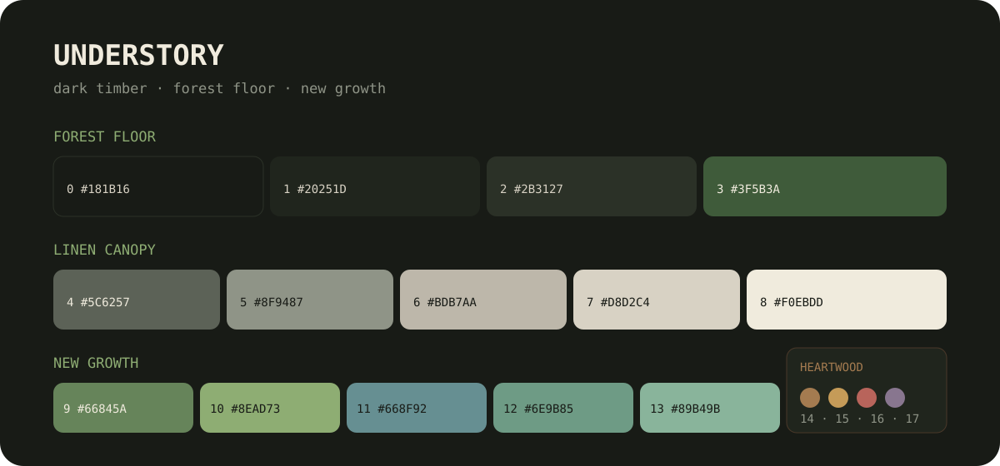

# Understory

<p align="center">
  <strong>A dark tropical-understory color palette.</strong><br>
  Cool canopy shadow. Warm hardwood. Green that keeps climbing.
</p>

<p align="center">
  
</p>

<p align="center">
  
  
  
</p>

Understory takes its atmosphere from humid shadow, dark tropical hardwood,
filtered light, broad leaves, and vines reaching through the jungle floor. It
is designed as a portable source palette for terminals, editors, desktop
shells, syntax themes, and application interfaces.

## Color families

### Jungle Floor

The structural darks: backgrounds, raised surfaces, borders, and selections.

| Token | Hex | Suggested role |
| --- | --- | --- |
| `understory0` | `#181B16` | primary background |
| `understory1` | `#20251D` | elevated surface / ANSI black |
| `understory2` | `#2B3127` | borders and subtle separators |
| `understory3` | `#3F5B3A` | selection and active surface |

### Filtered Light

Warm neutrals that avoid the blue cast of conventional dark themes.

| Token | Hex | Suggested role |
| --- | --- | --- |
| `understory4` | `#5C6257` | comments / ANSI bright black |
| `understory5` | `#8F9487` | muted foreground |
| `understory6` | `#BDB7AA` | secondary foreground / ANSI white |
| `understory7` | `#D8D2C4` | primary foreground |
| `understory8` | `#F0EBDD` | emphasized foreground / ANSI bright white |

### Tropical Growth

The living core of the palette: moss, ferns, vines, water, links, and success states.

| Token | Hex | Suggested role |
| --- | --- | --- |
| `understory9` | `#66845A` | primary moss / ANSI green |
| `understory10` | `#8EAD73` | active growth / ANSI bright green |
| `understory11` | `#668F92` | shaded water / ANSI blue |
| `understory12` | `#6E9B85` | fern / ANSI cyan |
| `understory13` | `#89B49B` | fresh fern / ANSI bright cyan |

### Heartwood

Warm accents for attention, syntax variety, warnings, and destructive states.

| Token | Hex | Suggested role |
| --- | --- | --- |
| `understory14` | `#A47B50` | wood / annotations |
| `understory15` | `#C59B58` | amber / warnings / ANSI yellow |
| `understory16` | `#B8645B` | clay red / errors / ANSI red |
| `understory17` | `#88768F` | dusk violet / keywords / ANSI magenta |

## Use it

The canonical values live in [`palette.json`](palette.json). Ready-to-import
representations are included for common theme workflows:

```text
palette.json             canonical tokens, families, and semantic roles
src/understory.css       CSS custom properties
src/understory.scss      Sass variables
src/understory.toml      TOML consumers
src/understory.yaml      YAML consumers
terminal/kitty.conf      Kitty and ANSI mapping
swatches/understory.gpl  GIMP/Inkscape palette
```

### CSS

```css
@import "understory.css";

body {
  color: var(--understory-fg);
  background: var(--understory-bg);
}
```

### Sass

```scss
@use "understory" as u;

.button--primary {
  color: u.$understory-0;
  background: u.$understory-accent;
}
```

## Port philosophy

Ports should feel native to their application while preserving the palette’s
relationships:

- `understory0` is the default dark background.
- `understory7` is the default foreground.
- `understory10` is the main interactive accent.
- `understory3` is preferred for selections behind light text.
- `understory16` and `understory15` communicate errors and warnings.
- Muted text should use `understory5`; comments may use `understory4` where
  contrast and font weight remain readable.

Do not mechanically apply every color. Good ports use restraint, preserve
application hierarchy, and verify contrast in the contexts they introduce.

## Contrast

Core interface pairings meet WCAG AA for normal text:

| Pair | Ratio |
| --- | ---: |
| foreground on background | `11.54:1` |
| emphasized foreground on background | `14.61:1` |
| accent on background | `6.94:1` |
| selection foreground on selection | `6.37:1` |
| muted foreground on background | `5.59:1` |

These measurements describe the raw sRGB colors. Port authors should retest
after introducing opacity, compositing, font weight, or application effects.

## Ecosystem

The first real-world implementation is the
[Understory Arch rice](https://github.com/dieg0net/dotfiles-arch). Dedicated
ports can live in their own repositories as the ecosystem grows.

## Contributing

Port proposals, accessibility improvements, format additions, and carefully
reasoned palette feedback are welcome. See [CONTRIBUTING.md](CONTRIBUTING.md).

## License

[MIT](LICENSE) © dieg0
